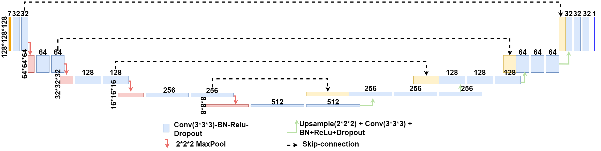
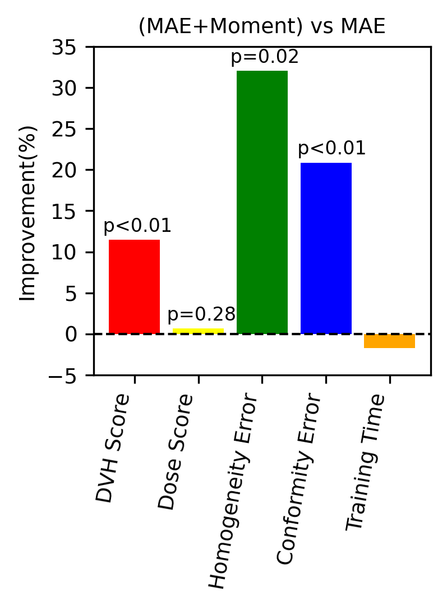
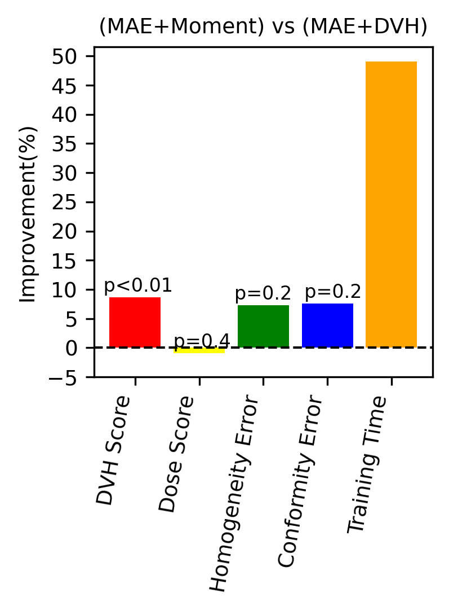

<!-- PROJECT LOGO -->
<br />
<p align="center">
    <h1 align="center"><strong>Domain Knowledge Driven 3D Dose Prediction Using Moment-Based Loss Function</strong></h1>
    <p align="center">
    <a href="https://arxiv.org/pdf/2207.03414.pdf">PMB'22 Paper</a>
    |
    <a href="#installation">Installation</a>
    |
    <a href="#usage">Usage</a>
    |
    <a href="https://github.com/nadeemlab/DoseRTX/issues">Issues</a>
  </p>
</p>


## Domain Knowledge Driven 3D Dose Prediction Using Moment-Based Loss Function [PMB'22]

*Objective:To propose a novel moment-based loss function for predicting 3D dose distribution for the challenging conventional lung IMRT plans. The moment-based loss function is convex and differentiable and can easily incorporate clinical dose volume histogram (DVH) domain knowledge in any deep learning framework without computational overhead.*
*Approach: We used a large dataset of 360 (240 for training, 50 for validation and 70 for testing) conventional lung patients with 2Gy × 30 fractions to train the deep learning (DL) model using clinically treated plans at our institution. We trained a UNet like CNN architecture using computed tomography (CT), planning target volume (PTV) and organ-at-risk contours (OAR) as input to infer corresponding voxel-wise 3D dose distribution. We evaluated three different loss functions: (1) The popular Mean Absolute Error (MAE) Loss, (2) the recently developed MAE + DVH Loss, and (3) the proposed MAE + Moments Loss. The quality of the predictions was compared using different DVH metrics as well as dose-score and DVH-score, recently introduced by the AAPM knowledge-based planning grand challenge*
*Main results: Model with (MAE + Moment) loss function outperformed the model with MAE loss by significantly improving the DVH-score (11%, p<0.01) while having similar computational cost. It also outperformed the model trained with (MAE+DVH) by significantly improving the computational cost (48%) and the DVH-score (8%, p<0.01)*
*Significance: DVH metrics are widely accepted evaluation criteria in the clinic. However, incorporating them into the 3D dose prediction model is challenging due to their non-convexity and non-differentiability. Moments provide a mathematically rigorous and computationally efficient way to incorporate DVH information in any deep learning architecture.*

## Dataset
We used 360 randomly selected lung cancer patients treated with conventional IMRT with 60Gy in
30 fractions at Memorial Sloan Kettering Cancer Center between the year 2017 and 2020. All these
patients received treatment and therefore included the treated plans which were manually generated by
experienced planners using 5–7 coplanar beams and 6 MV energy. All these plans were generated using EclipseTM V13.7-V15.5 (Varian Medical
Systems, Palo Alto, CA, USA).
The first CIR dataset, released [here](https://zenodo.org/record/6762573), contains almost 1000 radiologist QA/QC’ed spiculation/lobulation annotations (computed using our published [LungCancerScreeningRadiomics](https://github.com/choilab-jefferson/LungCancerScreeningRadiomics) library [CMPB'21] and QA/QC'ed by a radiologist) on segmented lung nodules for two public datasets, LIDC (with visual radiologist malignancy RM scores for the entire cohort and pathology-proven malignancy PM labels for a subset) and LUNGx (with pathology-proven size-matched benign/malignant nodules to remove the effect of size on malignancy prediction). 


## Deep Learning Model For 3D Dose Prediction Using Domain Based Moment Loss Function


*We train a Unet like CNN architecture to output the voxel-wise 3D dose prediction corresponding to an input comprising of 3D CT/contours which are concatenated along the channel dimension. The network follows a common encoder-decoder style architecture which is composed of a series of layers which progressively downsample the input (encoder) using max pooling operation, until a bottleneck layer, where the process is reversed (decoder). Additionally, Unet-like skip connections are added between corresponding layers of encoder and decoder. This is done to share low-level information between the encoder and decoder counterparts. The network (Figure 2) uses Convolution-BatchNorm-ReLU-Dropout as a block to perform series of convolution. Dropout is used with a dropout rate of 50%. Maxpool is used to downsample the image by 2 in each spatial level of encoder. All the convolutions in the encoder are 3×3×3 3D spatial filters with a stride of 1 in all 3 directions. In the decoder we use trilinear upsampling followed by regular 2 × 2 × 2 stride 1 convolution. The last layer in the decoder maps its input to a one channel output (1283, 1).*

## Installation
It is highly recommended to install dependencies in either a python virtual environment or anaconda environment. Instructions for python virtual environment:
Install all the dependencies present in requirements.txt
```bash
python3 -m venv venv
source venv/bin/activate
(venv) pip install requirements.txt
```
Please use this [link](https://github.com/facebookresearch/pytorch3d/blob/main/INSTALL.md#3-install-wheels-for-linux) for the details of pytorch3d installation.

## Usage
```bash
git clone --recursive git@github.com:nadeemlab/DoseRTX.git
```
High level usage instructions are detailed below. Detailed instructions at each step, including running pre-trained models, are described in following subsections.


Step 1: You have to first perform data pre-processing using pre-process data module. `python data_preprocess.py --in_dir dicom_input_dir --out_dir output_dir `

Step 2: Now execute `python train.py --dataroot train_data_directory --netG stand_unet --name planName --model doseprediction3d --direction AtoB --lambda_L1 1 --dataset_mode dosepred3d --norm batch --batch_size 1 --pool_size 0 --display_port 8097 --lr 0.0002 --input_nc 7 --output_nc 1 --display_freq 10 --print_freq 1 --gpu_ids 0,1,2` and this will start training the network.

Step 3: Test the trained model. `python3 test.py --dataroot test_data_directory --netG stand_unet --name planName --phase test --mode eval --model doseprediction3d --input_nc 7 --output_nc 1 --direction AtoB --dataset_mode dosepred3d --norm batch --gpu_ids 1`

### Data Pre-processing
Pre-processed data will be saved in out_dir directory.

Step 2.0: Generate nrrd files using data preprocess

- Pre-processed data is available [here](https://zenodo.org/record/6762573).
```bash
   tar xjvf TCIA_Lung_Dataset.tar.bz2
```

Step 2.1: 
- Input: Each case consists of five nrrd files (SimpleITK)  
    1. LUNG1_CT.nrrd                - CT Image  
    2. LUNG1_dose.nrrd              - dose in orginal resolution
    3. LUNG1_dose_resampled.nrrd          - dose mapped to CT orginal resolution  
    4. LUNG1_PTV.nrrd    - PTV mask  
	5. LUNG1_RTSTRUCTS.nrrd    - OAR mask
- Output: Each case consists of six npy files (numpy) - 128x128x128 cubic image patch  
    1. CT.npy           - CT Image  
    2. dose.npy          - Actual dose  
    3. PTV.npy       - PTV mask  
    4. OAR.npy        - OAR mask
	5. hist.npy        - volume at or above a given dose threshold value
	6. bins.npy        - dose thresold values
- Sampled Pre-processed data is available for TCIA lung patients [here](https://zenodo.org/record/6762573).
```bash
   tar xjvf TCIA_Lung_Dataset.tar.bz2
```
  
Step 2.2: Divide datasets into subsets (Training, Validation, Testing)


### Running Pre-trained Models
Donload the pretrained model from the links below and put them in checkpoints folder
1. Dose prediction using (MAE) loss is available [here](https://zenodo.org/record/6762573)
```bash
    tar xjvf latest_net_G.tar.bz2
    python3 test.py --dataroot test_data_directory --netG stand_unet --name MAE_loss --phase test --mode eval --model doseprediction3d --input_nc 7 --output_nc 1 --direction AtoB --dataset_mode dosepred3d --norm batch --gpu_ids 1
```
2. Dose prediction using (MAE+DVH) loss is available [here](https://zenodo.org/record/6762573)
```bash
    tar xjvf latest_net_G.tar.bz2
    python3 test.py --dataroot test_data_directory --netG stand_unet --name MAE_DVH_loss --phase test --mode eval --model doseprediction3d --input_nc 7 --output_nc 1 --direction AtoB --dataset_mode dosepred3d --norm batch --gpu_ids 1
```
3. Dose prediction using (MAE+DVH) loss is available [here](https://zenodo.org/record/6762573)
```bash
    tar xjvf latest_net_G.tar.bz2
    python3 test.py --dataroot test_data_directory --netG stand_unet --name MAE_Moment_loss --phase test --mode eval --model doseprediction3d --input_nc 7 --output_nc 1 --direction AtoB --dataset_mode dosepred3d --norm batch --gpu_ids 1
```

### Reproducibility [PMB'22]
The following bar charts shows evaluation of different DVH metrics using model trained with MAE, (MAE+DVH) and (MAE+Moment) loss (as **reported in the paper**).





![Comparison of different metrics for (a) MAE vs (MAE + Moment) and (b) (MAE+ DVH) vs (MAE + Moment)
losses. Y axis shows the relative improvement(in %) using (MAE+Moment) loss compared to MAE and (MAE+DVH)
loss. The higher is always better. For statistical analysis, Wilcoxon signed-rank test was used and p = 0.05 was considered
statistically significant.]


## Acknowledgments
* This code is inspired by [CycleGAN](https://github.com/junyanz/pytorch-CycleGAN-and-pix2pix).

## Reference
If you find our work useful in your research or if you use parts of this code or the dataset, please cite the following papers:
```
@article{jhanwar2022domain,
  title={Domain Knowledge Driven 3D Dose Prediction Using Moment-Based Loss Function},
  author={Jhanwar, Gourav and Dahiya, Navdeep and Ghahremani, Parmida and Zarepisheh, Masoud and Nadeem, Saad},
  journal={arXiv preprint arXiv:2207.03414},
  year={2022}
}
@article{dahiya2021deep,
  title={Deep Learning 3D Dose Prediction for Conventional Lung IMRT Using Consistent/Unbiased Automated Plans},
  author={Dahiya, Navdeep and Jhanwar, Gourav and Yezzi, Anthony and Zarepisheh, Masoud and Nadeem, Saad},
  journal={arXiv preprint arXiv:2106.03705},
  year={2021}
}
```